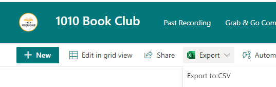

# Usage Guidelines

## Prerequisites:
1. Python 
2. Git
3. GitHub
4. Have this repository cloned on your device.
5. Have write access to this repository.

## How to update the booklist:
1. Download .csv file from the [SharePoint list](https://intel.sharepoint.com/sites/1010bookclub/Lists/1010%20Book%20Club%20Repository/AllItems.aspx).

2. Move it to the root directory of this repository. 
3. Rename it to a name with no spaces, like 'booklist.csv'.
4. Execute the following in a terminal at the root directory of this repository:
```
python update_booklist.py <path_to_csv>
```
5. Commit and push README.md to the remote repository.
6. (optional) Delete the .csv file.
